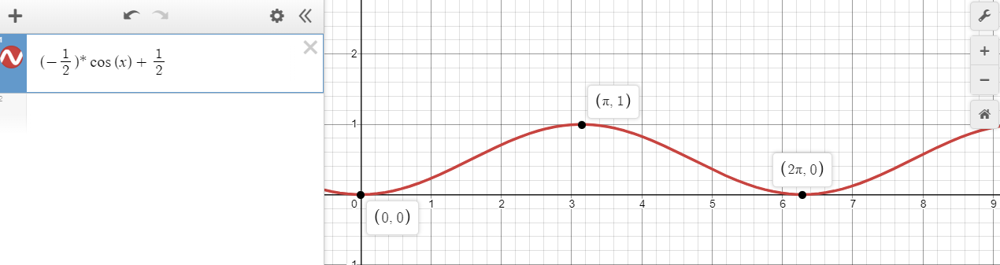

# AVR Exploration

This is a project that is inteded to explore some of the more advanced features that the Atmega328p offeres by programming this in Embedded C. I am using the Arduino Uno Rev3 as a development board because of how easily accessible it is. I have also purchased an Atmel ICE to program the chip through its ICSP header using SPI. I am using Atmel Studio 7 as the development enviroment and the following datasheets for reference material.

* [Arduino Uno Schematic](https://www.arduino.cc/en/uploads/Main/Arduino_Uno_Rev3-schematic.pdf)
* [Atmel-ICE User Guide](http://ww1.microchip.com/downloads/en/DeviceDoc/Atmel-ICE_UserGuide.pdf)
* [ATmega382p Datasheet](http://ww1.microchip.com/downloads/en/DeviceDoc/Atmel-7810-Automotive-Microcontrollers-ATmega328P_Datasheet.pdf)
* [ATtiny85-20P Datasheet](https://www.mouser.com/datasheet/2/268/Atmel-2586-AVR-8-bit-Microcontroller-ATtiny25-ATti-1315542.pdf)

## Table of Contents
* [1.1. ATmega328p/Blink Project Notes](#11-atmega328pblink-project-notes)


## 1.1. ATmega328p/Blink Project Notes:
------
### Fast PWM Mode:
The pins listed below are the pins we will be using for the waveform generation of the PWM signal of two different color LED's.  
*NOTE: These value where determined from the datasheets referenced above.*

* **PB1** (PCINT1/OC1A)
* **PB2** (PCINT2/SS/OC1B)

These pins are both on **PORTB** which means to use these pins as ouputs, we need to toggle their value in the Data Direction Register for PORTB (**DDRB**) high (logic 1).
This can be done with the following statement: 

```c
DDRB |= 0x03 // This is equivalent to 0000 0011 and setting PB1 and PB2 as outputs.
```

Next we are going to focus on the **ICR1** which we will use to define our TOP off value.
This can be done with the following statement: 

```c
ICR1 = 0xFFFF; // This is setting our TOP value to 16-bit max.
```

Once our cut off is defined 

Next we are going to focus on the **OCR1A** which we will use to define our compare value. Otherwise the TCNT1 will just reset when the TOP value is reached.
This can be done with the following statement: 

```c
OCR1A = 0x00FF; // This should produce a duty cycle of 50%.
```

Next we need to focus on setting the proper modes of the timer/counter.

More specifically we want a non-inverting, Fast PWM waveform that uses ICR1 as the TOP value with no prescaling. 
This can be done with the following statement: 

```c
TCCR1A |= (1 << WGM11);
TCCR1B |= (1 << WGM12)|(1 << WGM13);
// set Fast PWM mode using ICR1 as TOP
    
TCCR1B |= (1 << CS10);  // START the timer with no prescaler.
```

Now that we have the initial configuration set-up for the microcontroller,  it is time to look at the main logic of the program. To start we must consider the cyclic nature of  “breathing pulse” to be able to model this behaviour into an LED. When the term “cyclic” is used, people often first think of a sine or cosine wave. There are a few problems to consider with this model though. Both sine and cosine waves have vertical bounds of 1 and -1 and limitless horizontal bounts (they go on forever). We can fix the vertical limitation easily enough with some manipulation of the function but the limitless horizontal bound might be tricky since infinity and computers often don't get along. One potential solution around this is to have a repeating while loop which alters the function after every iteration so that the values it is calculating get reset and never increase beyond something a computer can’t handle. The mathematica model can be seen below as well as our solution to the ever growing values of the cosine function. I have chosen to use a modulo which will return the remainder of the two values divided by each other. This will keep our value between 0 and 360 (or 2*pi in radians).



The solution below represents two leds pulses modeled with the above equation with different phase shifts.

```c
// Main function
int main(void)
{
	char pin5 = 0x20; // This defines the DDRx Register for PORTB. This should be 0001 0000
	blinkOnBoardLEDConfig(pin5);
	fastPWMModeCofig();
	//changeFastPWMDutyCycle(OCR1A);
	unsigned short int x1 = 0;
	unsigned short int x2 = 90;
	
	/* Replace with your application code */
	while(1)
	{
		double fx1 = ((-0.5)*cos((x1*M_PI)/180) + 0.5);
		double fx2 = ((-0.5)*cos((x2*M_PI)/180) + 0.5);
		unsigned short int y1 = 0xFFFF*fx1;
		unsigned short int y2 = 0xFFFF*fx2;
		OCR1A = y1;
		OCR1B = y2;
		x1 %= 360;
		x2 %= 360;
		x1++;
		x2++;
		_delay_ms(15);
		
		// This blinks an led on and off. Useful for debugging and testing of the MCU control
		//blinkOnBoardLED(pin5, DELAY_VAL_MS);
	}
	return 0;
}
```

